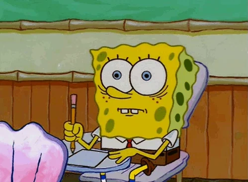

# Tic-Tac-Toe: The Unbeatable AI Edition

 Welcome to the ultimate challenge! This is a test version of Tic-Tac-Toe where you face off against an AI that won’t let you win. Powered by the mighty Minimax algorithm, this AI is unbeatable… for now! 😎
### Features:

- Unbeatable AI: Using the Minimax algorithm, the AI will make the best move every time. You better be good!
- Gameplay: Play as either the human or the computer, but don’t expect to win against the AI anytime soon. It’s that smart.

### How to Play:

  1. Compile the game by combining these three .c files:

    gcc tic_tac_toe.c tic_tac_playfunction.c tic_tac_util.c

  2. Then, run the game:

    ./a.out

  3. Enjoy the game! (Or maybe cry a little as you lose to the computer 😜).

### Known Issues:

  - This is still a work in progress, so expect some rough edges.
  - The AI is unbeatable for now. You might want to practice a bit more… or just accept defeat gracefully. 😅

  
